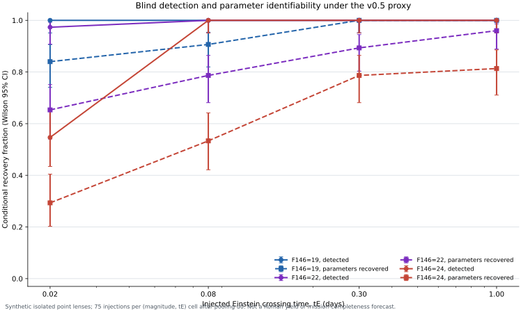

# Synthetic Point-Lens Microlensing Recovery Study

[](https://github.com/Biswajit1999/roman-microlensing-readiness/actions/workflows/ci.yml)
[](CHANGELOG.md)
[](LICENSE)

An independently implemented, blind injection/recovery experiment for
synthetic isolated point-lens events under a declared Roman-motivated cadence
and phenomenological noise proxy. This is not an official Roman product,
readiness assessment, population forecast, discovery pipeline, or analysis of
Roman flight data.

## v0.5 result



The predeclared balanced grid contains 900 injections: three F146 reference
magnitudes, three impact parameters, four Einstein crossing times, and 25
independent replicates per full grid cell. The primary summaries pool the
three `u0` values, giving 75 injections per `(magnitude, tE)` cell.

| Endpoint | Numerator / denominator | Fraction | Wilson 95% CI |
|---|---:|---:|---:|
| Event detection | 864 / 900 | 96.0% | 94.5–97.1% |
| Parameter recovery | 710 / 900 | 78.9% | 76.1–81.4% |
| Parameter recovery among detections | 710 / 864 | 82.2% | 79.5–84.6% |
| Simple constant-flux null trigger | 0 / 1,000 | 0.0% | 0.0–0.383% |

Detection is not identification. At F146=24 and `tE=0.02 d`, 41/75 events
cross the threshold (54.7%, CI 43.4–65.4%), while only 22/75 meet the
predeclared parameter tolerances (29.3%, CI 20.2–40.4%). Across the grid,
parameter recovery rises from 59.6% for trials with 3–9 epochs within one
`tE` to 90.9% with at least 30 epochs. This is an association inside this
balanced synthetic design, not a causal or population-level Roman estimate.

The 0/1,000 null result only constrains the declared Gaussian constant-flux
null. It does not represent Roman's false-positive rate because variable stars,
detector artifacts, blends, and non-microlensing transients are absent.

## What changed after the audit

- Truth-seeded fitting was replaced by a blind, fixed-search-space matched
  filter followed by a bounded PSPL fit.
- Event detection and parameter recovery became separate endpoints.
- Five reused seeds per cell became 900 parameter-aware master seeds, each
  split into independent cadence, event-epoch, and noise streams.
- Every raw row now retains fit status, injected and fitted parameters,
  cadence support, season-edge distance, and all random seeds.
- The cadence is a versioned public-design proxy: six 70.5-day seasons, three
  early and three late, sampled every 12.1 minutes in F146.
- The invalid custom binary-lens pathway remains preserved as a negative
  result but is runtime-disabled for scientific inference.

Earlier `results/default/` values used truth-seeded fitting and superseded
cadence assumptions. They remain historical artifacts, not current claims.

## Reproduce

```bash
python -m pip install -e ".[dev]"
pytest -q

romanmlr run-grid \
  --config configs/cadence_phase_v0.5.yaml \
  --out results/v0.5.0-release

romanmlr null-fpr \
  --config configs/cadence_phase_v0.5.yaml \
  --out results/v0.5.0-null \
  --n-trials 1000

python scripts/build_v0_5_evidence.py \
  --trials results/v0.5.0-release/trials.csv \
  --null-trials results/v0.5.0-null/null_trials.csv \
  --null-summary results/v0.5.0-null/null_summary.json \
  --out research
```

The committed manifests identify clean source commit `4dfb89f`, Python 3.12,
dependency versions, config SHA-256, RNG scheme, and platform. The raw tables,
endpoint summaries, generated evidence, [claims ledger](docs/CLAIMS.md),
[methods](docs/METHODS.md), [limitations](docs/LIMITATIONS.md), and
[reproduction guide](docs/REPRODUCIBILITY.md) are all versioned.

## Affiliation and marks

“Roman” and “F146” are used descriptively. This project is not affiliated with
or endorsed by NASA, STScI, IPAC, GSFC, or the Roman project.
